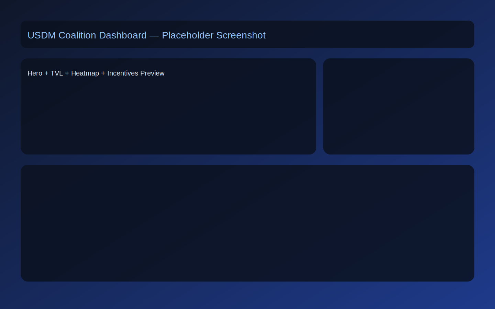
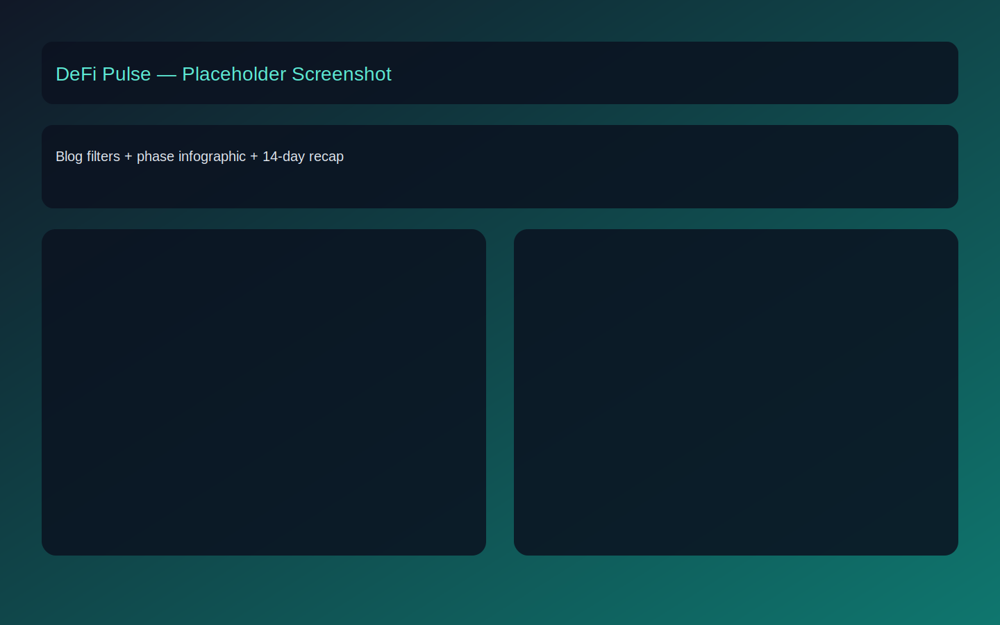

# USDM DeFi Coalition Dashboard — Proof of Growth

[](https://vercel.com/new)

Public-facing DeFi coalition dashboard for USDM growth on Cardano.

This project ships as a Next.js App Router application with query-backed UI sections, typed API routes, and reusable dashboard/content components.

---

## Visual Preview

> Placeholder preview assets are included in `public/images/screenshots/` until production screenshots are captured.

### Dashboard



### Blog / DeFi Pulse



### Social Preview Asset

- OG preview asset: `public/images/og-preview.svg`

---

## Stack

- Next.js 16 (App Router)
- React 19 + TypeScript
- Tailwind CSS 4
- TanStack Query v5
- Recharts
- Radix UI primitives
- Zustand
- React Markdown + remark-gfm
- Framer Motion (animations, page transitions)
- Three.js / @react-three/fiber + @react-three/drei (3D globe, entity nodes)
- tsparticles (blockchain-inspired particle background)
- Cardano Web3 stubs (wallet connect via Zustand store, Blockfrost/Charli3/Fluid API ready)
- Jest + React Testing Library

---

## Getting Started

```bash
npm install
cp .env.example .env.local
npm run dev
```

Open: `http://localhost:3000`

---

## Environment Variables

Defined in `.env.example`:

- `BLOCKFROST_API_KEY=`
  - Server-only, optional in MVP
  - Reserved for future live chain integrations
- `NEXT_PUBLIC_APP_URL=http://localhost:3000`
  - Public app origin for links/metadata contexts
- `NEXT_PUBLIC_DATA_MODE=mock`
  - `mock` (default): serves data from local mock provider
  - `live`: enables provider routing to live stubs (Blockfrost plumbing in place)
- `ADMIN_BASIC_AUTH_ENABLED=false`
- `ADMIN_BASIC_AUTH_USERNAME=`
- `ADMIN_BASIC_AUTH_PASSWORD=`
  - Reserved for `/admin` basic-auth middleware stub

---

## Scripts

```bash
npm run dev        # start development server
npm run build      # production build
npm run start      # serve built app
npm run lint       # run ESLint
npm test           # run Jest tests
npm run test:watch # run Jest in watch mode
```

---

## App Routes

- `/` — Dashboard
- `/blog` — DeFi Pulse (posts + timeline)
- `/blog/[slug]` — Blog detail page
- `/guides` — How-To Library
- `/entities` — Coalition entities
- `/incentives` — Incentive mechanics
- `/comms` — Communications hub
- `/institutional` — Institutional RWA narrative stub

---

## API Routes (MVP)

All API routes return typed responses and include structured error payloads.

As of Sprint 1, API routes use a provider factory:

- `src/lib/providers/index.ts` picks provider by `NEXT_PUBLIC_DATA_MODE`
- `src/lib/providers/mock.ts` returns current mock data
- `src/lib/providers/blockfrost.ts` is the live-mode stub (health check + contract-preserving fallback)

- `GET /api/tvl`
- `GET /api/utilization`
- `GET /api/incentives`
- `GET /api/blog`
- `GET /api/blog/[slug]`
- `GET /api/entities`
- `GET /api/comms`
- `GET /api/guides`

---

## Data Flow Pattern

1. API route returns typed JSON
2. `src/lib/api.ts` fetch helper consumes route
3. TanStack hook in `src/lib/hooks/*` wraps query config
4. `*DataSection` component handles loading/error/retry
5. Presentational component renders filtered/interactive UI

For primary coalition endpoints (`/api/tvl`, `/api/utilization`, `/api/incentives`, `/api/blog`), the route internals now resolve through the provider layer before returning data.

---

## Sprint 1 Highlights

- Recharts-based interactive utilization heatmap with tooltips, asset filters, and color legend
- Mock/live data mode toggle with provider factory abstraction
- Query refetch intervals are now configurable and enabled automatically in live mode
- Theme preference persistence via Zustand `persist`
- Core layout/nav/sidebar/footer updated to use theme tokens for dark/light switching

## Sprint 2 Highlights

- Incentives page now includes a boost calculator with 30-day eligibility progress simulation
- Incentive cards include explicit eligibility status labels
- Coming Soon teasers added for incentives and entities, plus `/institutional` teaser route
- Guides upgraded with embed-style media placeholders and expanded flow steps (including DCA path)
- Blog now includes a phase infographic and a "14 Days of USDM" recap panel

## Sprint 3 Highlights

- Added skip-to-content link and explicit chart labels for improved keyboard/screen-reader accessibility
- Added API route hardening helpers: per-route rate limiting and CORS headers
- Added security headers in `next.config.ts` (CSP, frame/content/referrer/permissions policies)
- Added middleware-based admin basic-auth guard stub for future `/admin` route

## Sprint 4 (Current) Highlights

- Blog content now supports repo-local markdown files under `src/content/blog/*.md`
- Content loader in `src/lib/content/blog.ts` parses front matter and preserves `BlogPost` contracts
- CMS decision log added at `.agent/tasks/cms-evaluation.md` (Git markdown selected for now)
- Entity content ownership/removal policy model added and surfaced on `/entities`
- `/admin` preview stub added (protected by proxy basic-auth guard when enabled)

## Design Overhaul Highlights

- **Hyper-modern Web3 aesthetic**: black/near-black gradient backgrounds, glassmorphism cards, glow effects
- **Inter font** with bold headings, clean uppercase tracking for section labels
- **Color system**: Blue (#007BFF) for USDM, Gold (#FFA500) for fGLD/yields, Green (#00FF88) for positive, Red (#FF4444) for alerts
- **3D rotating globe** on Dashboard hero with entity nodes (Three.js / R3F)
- **Particle background** (tsparticles) with subtle blockchain-inspired floating dots
- **Animated TVL counter** with spring physics on the hero section
- **Wallet connect** button in navbar with Eternl/Nami/Lace support (mock CIP-30)
- **New `/wallet` page** with personal dashboard: positions, incentives earned, transaction history
- **Framer Motion** throughout: fade-in animations, staggered lists, hover lifts, animated nav indicator
- **Glassmorphic cards** across all pages with accent-colored borders and hover glow
- **Web3 module stubs** in `src/web3/` ready for Lucid.js / Blockfrost integration
- **`.env.example`** updated with Blockfrost, Charli3, Fluid API stubs

This pattern is used across dashboard/blog/entities/incentives/comms/guides sections.

---

## Project Structure

```text
src/
  app/               # pages + API routes
  components/        # UI and data-section components
  lib/               # api helpers, hooks, constants, mock data
  store/             # zustand stores
  types/             # domain and API types
  __tests__/         # component tests
public/
  logos/
.agent/              # agent docs, workflows, SOPs, skills
```

---

## Quality Gates

Before shipping:

```bash
npm run lint
npm test -- --runInBand
npm run build
```

---

## Deployment

Primary target: Vercel.

Typical flow:

1. Push to `main`
2. Vercel build runs
3. Verify `/api/*` and page routes in preview/production

Detailed deployment and workflow docs:

- `.agent/workflows/deploy.md`
- `.agent/workflows/build.md`
- `.agent/workflows/test.md`

---

## `.agent` Documentation

The `.agent/` directory defines the project playbook used for AI-assisted implementation.

- `tasks/` tracks PRD, backlog, feedback tasklist, and lessons learned
- `system/` documents architecture, data models, and API contracts
- `workflows/` contains repeatable procedures (`build`, `test`, `deploy`, etc.)
- `skills/git-commit-formatter/SKILL.md` enforces Conventional Commit formatting for task/sprint commits

---

## Commit Convention

This repository uses Conventional Commits for task-level changes.

- Reference: `.agent/skills/git-commit-formatter/SKILL.md`
- Optional local hook setup: `.agent/workflows/enable-hooks.md`
